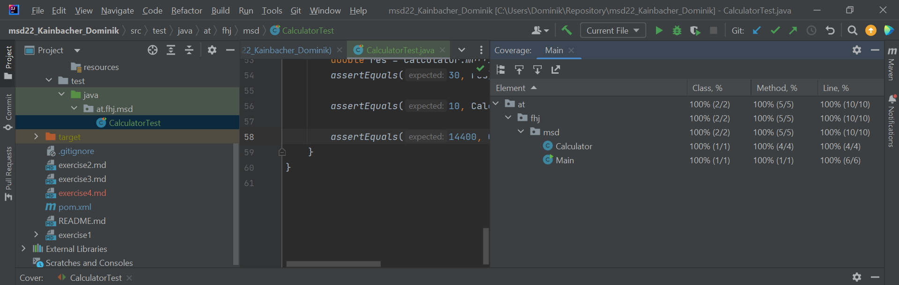
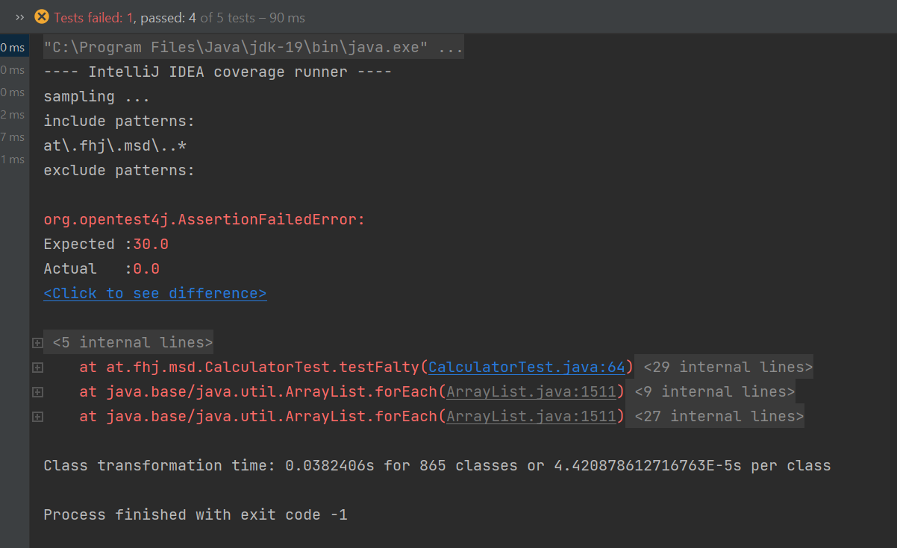

# Exercise 4
## Java Tests

Testcases:
1. test add()
   + 1+3=3 simple first test
   + 7.5+2.5=10 test to check the  handeling of decimals 
   + 1+99999=100000 test to check the handeling of big number
2. test minus()
   + 1-2=-1 simple check for negative numbers
   + 7.5-2.5=5 test to check the handeling of decimals
   + 1-100000=-99999 test to check the handel of big numbers
3. test divide()
    + 10/2=5 simple first check
    + 1/2=0.5 simple check with decimals
    + 100000/100=1000 test to check the handel of big numbers
4. test multipy()
   + 6*5=30 simple first test
   + 2.5*4 test to check the handeling of decimals
   + 120*120=14400 test to check the handel of big numbers

