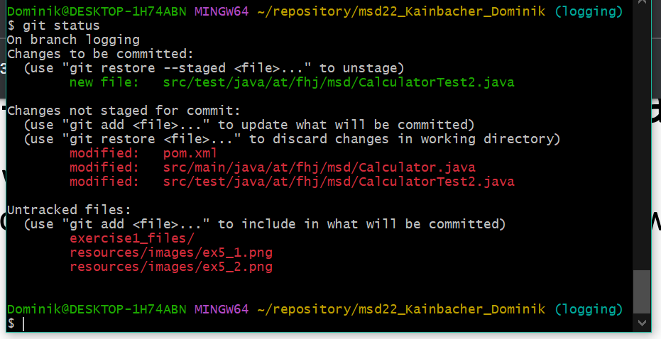
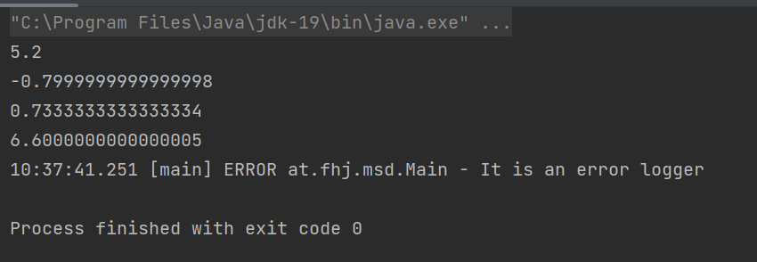
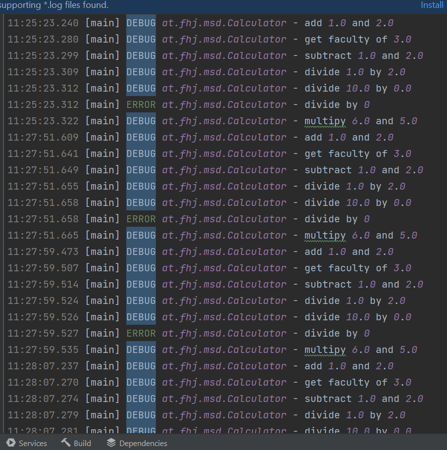
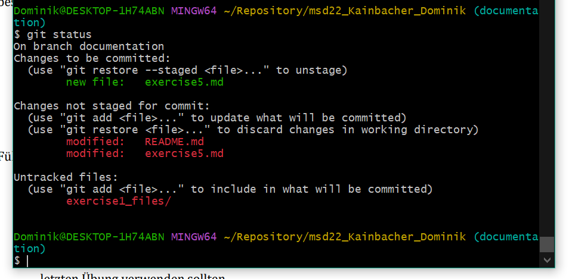

# Exercise 5
## Branching

+ ### Warum werden Logging Bibliotheken verwendet? 
  + einfach nachvolziehen von verschieden version mit protokollen. 

+ ### Welche Loglevel gibt es in Log4J und was hat es damit auf sich?
  + ALL:	All levels including custom levels.
  + DEBUG:	Designates fine-grained informational events that are most useful to debug an application.
  + INFO:	Designates informational messages that highlight the progress of the application at coarse-grained level.
  + WARN:	Designates potentially harmful situations.
  + ERROR:	Designates error events that might still allow the application to continue running.
  + FATAL:	Designates very severe error events that will presumably lead the application to abort.
  + OFF:	The highest possible rank and is intended to turn off logging.
  + TRACE:	Designates finer-grained informational events than the DEBUG.

+ ### Was für Konfigurationsmöglichkeiten bietet Ihnen log4J?
   Configuration of Log4j 2 can be accomplished in 1 of 4 ways:

1) Through a configuration file written in XML, JSON, YAML, or properties format.
2) Programmatically, by creating a ConfigurationFactory and Configuration implementation.
3) Programmatically, by calling the APIs exposed in the Configuration interface to add components to the default configuration.
4) Programmatically, by calling methods on the internal Logger class.

