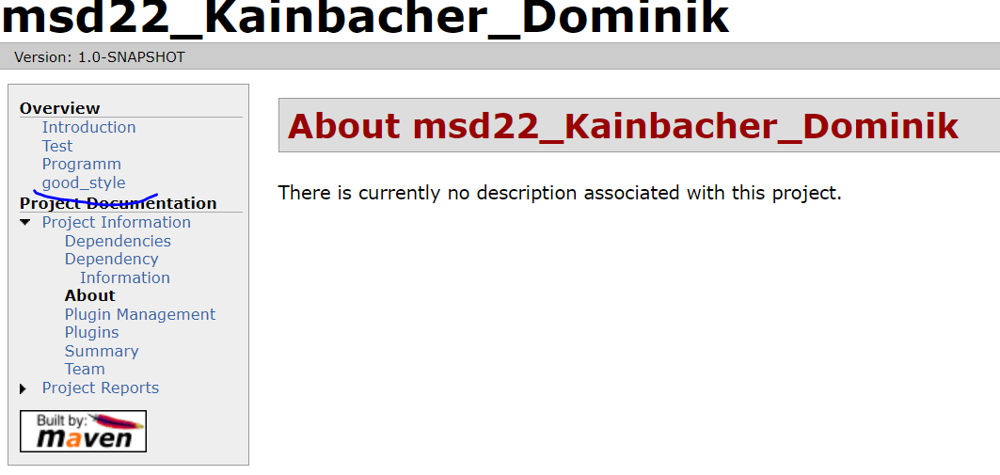

# Exercise 6
## Projektdokumentation

Was ist notwendig um Maven Site Dokumentation zu generieren?

## Pom
POM bedeutet "Project Object Model" und wird repräsentiert durch eine XML-Datei, üblicherweise die pom.xml, die als zentrale Projektbeschreibungs- und -steuerungsdatei Meta-Daten zum Projekt enthält, unterteilt in die fünf Bereiche Koordinaten, Projektbeziehungen, Projektinformationen, Projekteinstellungen und Projektumgebung.
Wichtige Einträge sind zum Beispiel: groupId, artifactId, version, packaging, build, dependencies, profiles und properties.

# Sites
Mit Site ist eine Art Website gemeint, also eine Zusammenstellung von Webseiten, die als Projektdokumentation dient.